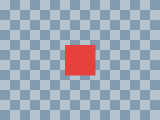
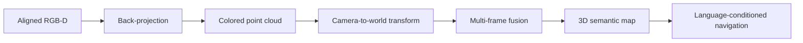

# 实验 01：RGB-D 转点云

目标：理解一个像素怎样变成有米制坐标的三维点。这是开放词汇具身导航项目的第一个可运行实验，先建立 RGB-D、相机内参与三维坐标之间的正确关系。CPU 即可运行。



## 先运行

Windows 可双击 `run.cmd`，脚本执行后会打开 `results/viewer.html`。

在其他已安装 Python 的机器上：

```powershell
python -m pip install -r requirements.txt
python rgbd_to_pointcloud.py
```

依赖仅为 NumPy 与 Pillow。

## 输入是什么

这是程序生成的、像素对齐的合成 RGB-D 教学数据，不是真实采集结果或模型预测。
320×240 图像中，红色方形面位于 Z=1 m，背景墙位于 Z=2 m。
内参 fx=fy=300 像素，cx=160、cy=120 像素。
原始深度使用 uint16 毫米；除以 1000 得到米。深度表示光轴方向 Z，不是相机到点的欧氏距离。
相机坐标采用 X 向右、Y 向下、Z 向前。本实验未使用外参，不输出世界坐标。

## 只读懂这三个式子

```python
z = depth_raw / 1000.0
x = (u - cx) * z / fx
y = (v - cy) * z / fy
```

RGB 负责给点上色；深度与相机内参决定点的位置。
先读 `make_rgbd()`，再读 `depth_to_pointcloud()`；可以先跳过网页和 PLY 导出代码。

## 通过标准

1. 终端显示 PASS，生成 76,800 个有效点。
2. 正视时红色面在中央，旋转后能看见它与墙面的距离。
3. 中心像素 (u=160, v=120) 输出 (X=0, Y=0, Z=1) 米。
4. 红色面左右边缘像素中心之间的距离为 0.200 米。

点云只记录可见表面：红色面后方没有墙面点，这是遮挡导致的观测缺失。

## 跑通后的练习

先不改文件，在纸上算像素 (190,120) 应为 (0.1,0,1) 米；到相机的距离约为 1.00499 米。
然后复制脚本做修改实验：将红色面深度由 1000 改为 1500 毫米，预测它的位置与重建宽度如何变化。
由于像素覆盖范围不变，宽度也会变为 0.3 米。原有检查会失败，这是预期结果；解释清楚后再更新检查中的预期值。

## 输出

- rgb.png：彩色输入。
- depth_mm.png：真正的 16-bit 毫米深度，可重新读取用于计算。
- depth_preview.png：8-bit 显示预览，不能代替原始深度。
- points_camera_m.npy、cloud.ply：完整相机坐标点云。
- viewer.html：离线可旋转预览，显示时每隔 3 像素采样。
- checks.json：内参、单位与数值检查结果。

下一实验：换一组有内参、深度单位说明且 RGB/Depth 已对齐的真实 RGB-D 数据，再运行相同反投影函数。
之后才增加相机外参和多帧融合。

## 项目路线中的位置



当前仓库完成前三步，且明确区分原始深度、显示用深度图、光轴深度与欧氏距离。

作者：Lijun Jin / 金利军（GitHub: [June027](https://github.com/June027)）

参考：[Open3D RGB-D images tutorial](https://www.open3d.org/docs/release/tutorial/geometry/rgbd_image.html)
